#Herramientas de depuración de Edge

En este laboratorio aprenderemos a usar las herramientas disponibles en línea y en el browser Microsoft Edge para depurarar aplicaciones web.


##Tarea 1 - Conociendo las herramientas en línea para la web moderna

1. Abrir **Microsoft Edge**
1. Navegar a la siguiente URL https://dev.modern.ie/tools/staticscan/
1. Esto abrirá la herramienta "Site Scan" la cual nos provee un dignóstico rápido del sitio en lo correspondiente a la adopción de mejores prácticas web <br/>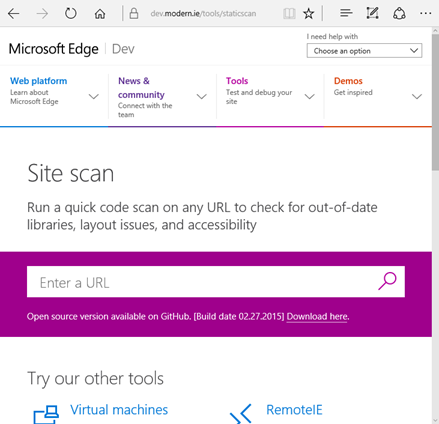
1. En el campo "Enter a URL" ingresamos una a una cada una de las siguientes URL e iniciamos el proceso de escaneo para cada una de ellas.
	* http://www.caracoltv.com/
	* http://www.canalrcn.com/
	* http://www.jpl.nasa.gov/
	* http://juank.io/
1. En cada uno de los reportes revisamos las secciones
	* Modern Web interoperability
	 * Render Mode
	 * Same Markup
	 * Legacy plug-ins and features
	 * Frameworks & libraries
1. Probar con una URL de la empresa o educación educativa a la que se pertenece yu realizar la prueba nuevamente, revisar los resultados

##Conociendo las herrmientas F12 de MS Edge

En las siguientes tareas se explorán las diferentes herramientas que MS Edge posee para realizar tareas de depuración en el browser

##Tarea 2 - El explorador del DOM  (Document Object Model)

1. Visite en MS Edge la sigueinte URL https://juank.io/lab-azure-desarrolladores-websites-mvc-entity-framework/ 
1. Presionar la tecla **F12** , esto hará que se abran las herramientas para desarrolladores de Microsoft Edge
1. Seguidamente presionar las teclas `Ctrl + 1` (no usar teclado númerico) para ir al DOM Explorer
1. Hacer click  en la  herramienta de selección <br/>
1. Luego deslizar el mouse sobre la siguiente imagen y dar click <br/>
1. En el panel del DOM explorer el código fuente navegará automáticamente hasta el tag de la imagen, tambien se debe notar que en la parte inferior figura la ruta completa para llegar al objeto seleccionado  <br/>
1. Seguidamente hacer drag and drop con el nodo `h2` que esta justo abajo de la imagen y soltarlo en la posición anterior a la imagen quedando de esta forma<br/>
1. Observar el efecto en el sitio web, estos cambios son temporales y permiten al desarrollador ver que sucederia al cambiar porciones de código sin necesidad de modificar el código de la solución ni refrescar la página actual<br/>
1. Nuevamente en el tag de la imagen modificar la propiedad **src** hy asignar la siguiente URL https://s.gravatar.com/avatar/33a44352230be7166bd4f23ec11bb756?s=250
1. En el browser se debe visualizar una imagen nueva de la siguiente forma<br/>
1. Refrescar la página y verificar que ninguno de los cambios efectuados son persistentes y han sido revertidos
1. Cargar nuevamente el explador de DOM
1. En el costado derecho se encuentra el editor de estilos en cascada, este componente permite modificar los estilos de los componentes creados en el DOM.
1. Desplazarse hasta el final de la página justo donde aparecen los siguientes íconos<br/>
1. En el Dom Explorer usar la herramienta de selección para seleccionar cualquiera de los íconos<br/>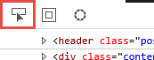
1. Esto hará que el DOM explorer se posicione sobre el tag correspondiente generando una visualización similar a esta:<br/>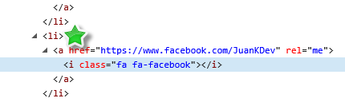
1. Justo donde aparece la estrella encontramos un nodo `<li>` que envuelve al ícono, damos click en este nodo
1. en el explorador de estilos en cascada hay ue ubicar el nodo que se ve en la imagen a continuación <br/>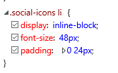
1. desmarcamos el atributo `display` y veremos como la alineación de los objetos cambia, luego lo volvemos a marcar como estaba <br/>
1. desmarcamos el atributo `font-size` y veremos como la alineación de los objetos cambia, luego lo volvemos a marcar como estaba <br/>
1. desmarcamos el atributo `padding` y veremos como la alineación de los objetos cambia, luego lo volvemos a marcar como estaba<br/>
1. Sobre el nodo `.social-icons li` damos click derecho y seleccionamos la opción "Add Property" <br/>
1. En el recuadro que se abre escribimos `background-color` nótese que Microsoft Edge cuenta con *Intellisense*  lo cual permite autocompletado de los nombres de estas propiedades
1. Hacemos click adelante de la propiedad recién creada para asignarle un valor, allí seleccionamos en la lista el valor `mistyrose` con ayuda del *Intellisense*
1. Una vez asignado podemos ver el resultado <br/>
1. Haciendo click en el color generado se puede acceder al *Color Picker* donde se puede configurar el color que se requira, podemos seleccionar cualquiera a gusto propio
1. Esto asignará un valor de color en formato rgba<br/>
1. En el explorador de CSS vamos ahora a la pestaña "Computed"
1. Allí también se listan todos los estilos asignados al objeto seleccionado, con la diferencia que ahora solo se muestran los estilos aplicados al final de aplicar todo lo definido, puesto que pueden haber estilos que sobre escriban otros estilos espécificos. Es decir acá se muestran los estilos definitivos con lo que se renderiza el objeto.
1. Asegurarse que en  el Dom explorer este seleccionado uno de los nodos `li` que pertenecen a la lista de íconos de redes sociales
1. En la lista que se muestra en el "explorador de estilos" pestaña "Compute" buscar el nodo `color` y expandirlo
1. Allí se listan las propiedades asignadas a dicho nodo, en que archivo están definidas y en que línea de código se encuentran. En caso de que otros estilos se hayan sobre escrito entre si tambien se muestra que estilos aplicados no surtieron efecto.<br/>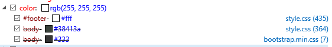
1. Vamos ahora a la pestaña Layout del **Explorador de Estilos**
1. Allí se puede ver un cuadro como este, que no es más que la representación el objeto seleccionado con
	* dimensiones
	* márgenes externos (margin)
	* márgenes internos (padding)
	* posición relativa (offset)
	* Borde (border)
1. Desde este panel podemos modificar cada una de esas propiedades
1. Modificar la propiedad padding estableciendo el valor derecho e izquierdo en 5, inmediatamente se puede ver su efecto en la página
1. Cambiamos ahora la propiedad margin izquiero y derecho asignando 20, inmediatamente se puede ver su efecto en la página
1. Cambiamos ahora la propiedad alto asignando 60, inmediatamente se puede ver su efecto en la página
1. En un escenario real todas las caracteristicas revisadas permiten hacer ajustes a la visualización del sitio web, especialmente durante la etapa de definición del front End. Sin embargo es dificil llevar registro de todos los cambios realizados a nivel de hojas de estilo por lo que Microsoft Edge muestra en la pestaña "Changes" un resumen de todos los cambios realizados en cada cambio de archivos de estilo. <br/>

##Tarea 3 - La Consola

1. Abrir una nueva pestaña de **Microsoft Edge**
1. Navegar a https://juank.io , esperar a que cargue
1. Presionar F12 para abrir las herramientas de desarrollo
1. Presionar `Ctrl + 2` (no usar teclado númerico) para ir a la Consola
1. Una vez abierta la consola navegar en el explorador a esta URL http://www.eltiempo.com/
1. La consola debe arrojar una serie de mensajes similares a estos<br/>
1. En la consola se puede ver información relacionada con el proceso de carga de la página web así como mensajes relacionados con la ejecución de scripts. Para un desarrollador tambien es posible enviar desde sus scripts información relevante de la ejecución de los mismos.
1. Al presionar click derecho sobre la superficie de la consola aparecerá el sieguiente menú de opciones <br/>
1. Desactivar y reactivar los siguientes Flags para observar el comportamiento en el reporte de mensajes de la consola
	* Errors
	* Warnings
	* Messages
	* Log
	* Display all

##Tarea 4 - El depurador

1. Abrir Microsoft Edge y navegar a https://juank.io/hol-azure-para-desarrolladores-fundamentos-websites/
1. Presionar F12 para abrir las herramientas para desarrolladores
1. Presionar `Ctrl + 3` (no usar teclado númerico) para ir al depurador (o debugger)
1. Presionar `Ctrl + o` para abrir el explorador de contenido en caso de que no este abierto<br/>
1. En este panel aparecerán listados todos los recursos a los que acceder el website en el proceso de carga no importa si estos están hosteados en otro lugar.  
1. Dar click en **Local Storage**
1. Inspeccionar cada uno de los nodos allí presentes, este nodo corresponde con los datos guardados en el browser por cada sitio listado
1. Inspeccionar **Session Storage** Este nodo almacena información relevante solo para la sesión actual
1. Inspeccionar **Cookies** 
1. Inspeccionar `juank.io/css`  y  `juank.io/js` , allí se encuentran todas las hojas de estilo o scripts hosteadas por el sitio en dicha ruta, pero bien podrian figurar otros archivos dependiendo de las desiciones del desarrollador
1. En la barra de pestañas (ver imagen) seleccionar "Close All Tabs"<br/>
1. En el explorador de contenido abrir `juank.io/js/prism.js` y en el panel de herramientas presionar el botón que se veen la imagen<br/>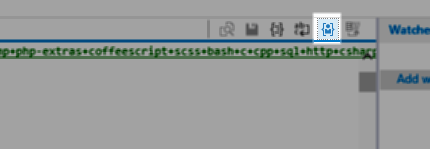
1. Este botón, cuando esta activo, marca el código como propio del desarrollador, cuando es inactivo lo marca como Libreria, esto es útil para que al depurar solo se haga pasos al código del desarrollador y no a librerias de terceros.
1. Los siguientes archivos de esa carpeta deben ser marcados como Libreria y como código de usuario según corresponda con esta imagen.<br/>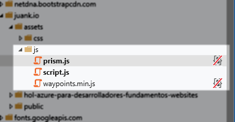
1. En el explorador de contenido abrir `juank.io/js/script.js`
1. El contenido de este archivo luce tal como está almacenado en el servidor, en este caso particular con espacios demás entre cada línea<br/>
1. En el panel de herramientas presionar el botón "Pretty Print"<br/>
1. El código ahora se muestra completamente reformateado para aumentar su legibilidad, se han eliminado espacios innecesarios y se han identado correctamente las líenas.<br/>
1. Estando el código de esta forma ponemos un `breakpint` en la línea 11 justo como se ve en la imagen<br/>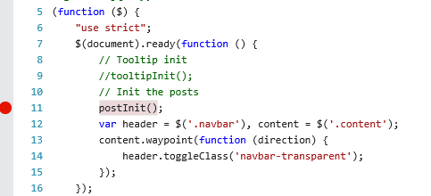
1. Recargamos la página y el depurador se detiene justo donde se puso el breakpoint<br/>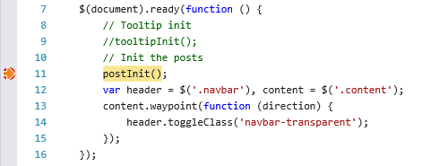
1. En el costado derecho podemos ver el panel "Watches" donde se puede ver el estado de las variables al momento de tocar el breakpoint e incluso navegar en sus propiedades.<br/>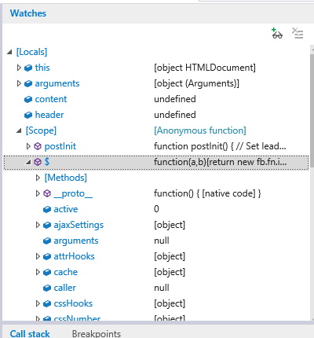
1. Desde este panel es posible agregar otras variables a parte de las detectadas automáticamente, presionamos el ícono de agregar inspección y agregamos una nueva variable llamada "this.testValue"<br/>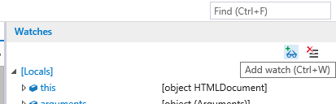
1.  Esta variable no existe en el código fuente, si existiera nos mostraría su valor tal como lo hace con las adicionadas automáticamente
1. En la parte inferior del depurador se puede visualizar la consola y justo bajo ella hay un símbolo del sistema <br/>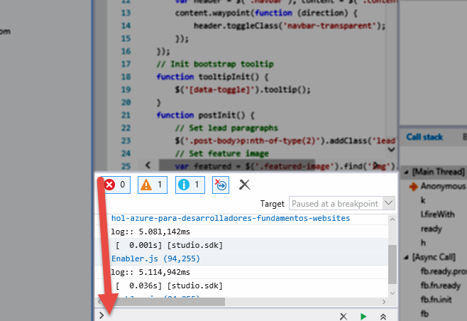
1. allí podemos ejecutar comandos de javascript, entre ellos crear una nueva variable 'al vuelo' así que crearemos la variable `this.testValue` ejecutando el siguiente comando en la consola (donde esta la flecha) 

    ```
    this.testValue = "Hello World Edge Tools";
    ```
1. Ahora al revisar de nuevo en la ventana de inspección (Watches) podemos ver la variable asignada <br/>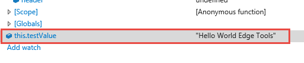
1. Desde este mismo panel tambien podemos cambiar el valor de la varible simplemente dando doble click y editando. Asignamos el valor "Hola Mundo Edge Tools"
1. De regreso a la consola ingresamos el siguiente comando obteniendo en la consola como respuesta la variable con el valor actualizado. Identificar como la consola también ofrece Intellisense en las variables creadas dinámicamante.

    ```
    this.testValue
    ```
1. De nuevo en el costado derecho, identificar el panel "Call Stack"  <br/>
1. Allí se lista la "Pila de Llamadas" que refleja el orden o anidamiento de funciones que se han ejecutado al llamar una función determinada, esto permite saber que función ha llamado a la función actual en ejecución y así susecivamente hasta identificar toda la cadena de funciones llamadas hasta llegar a la función actual. Dar click en la pestaña Breakpoints. 
1. Allí se listan los breakpoints creados, hasta el momento solo 1. <br/>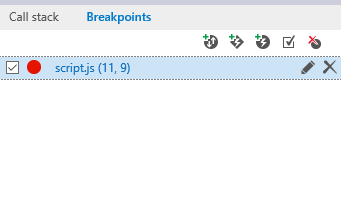
1. Damos click en el checkbox para deshabilitarlo
1. En el explorador del DOM presionamos el botón **play** para que el sitio continue su ejecución<br/>
1. Presionamos nuevamente F12, vamos a la pestaña debugger y allí navegamos una vez más hasta el archivo `juank.io/assets/js/sctipt.js`
1. deshabilitamos nuevamente el breakpoint y recargamos la página
1. el breakpoint no detiene el browser puesto que ha sido deshabilitado
